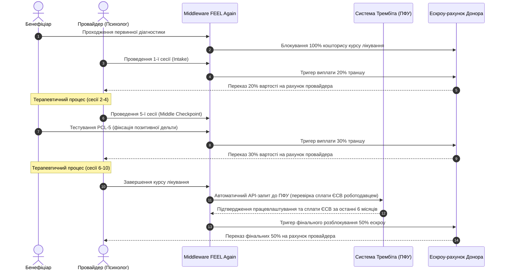

# РОЗДІЛ 3: ОПЕРАЦІЙНІ ТА ТЕХНІЧНІ СПЕЦИФІКАЦІЇ ЦИФРОВИХ КАБІНЕТІВ (section_3_cabinets.md)

Цей документ визначає функціональні вимоги, логіку авторизації, обмеження навантаження, правила оподаткування та протоколи смарт-клірингу для чотирьох типів користувацьких кабінетів.

## 3.1. Функціональна матриця кабінетів користувачів

Кожен кабінет розроблений під специфічні операційні потреби відповідної ролі, забезпечуючи взаємозв'язок клінічних та фінансових процесів.

| Тип кабінету | Процес онбордингу та верифікації | Ключові внутрішні розділи | Фінансові та розрахункові сервіси |
| :--- | :--- | :--- | :--- |
| Кабінет Бенефіціара (Пацієнта) | Первинна авторизація без підтвердження особи. Верифікація через Дія.Підпис потрібна лише на етапі призначення першої сесії для підтвердження права на безкоштовний курс. | Тестування за шкалами PCL-5, PHQ-9, GAD-7. Анонімний пошук фахівця за часом, геопозицією та рейтингом ефективності. Поточний кейс-менеджмент плану реабілітації. | Генерація персональної сторінки для P2P-збору коштів. Оплата особистої частки співфінансування обсягом 10.60 USD через Stripe. |
| Кабінет Провайдера (Психолога) | Миттєва верифікація через Дія.Підпис. Автоматичний запит до державних реєстрів для підтвердження диплома магістра за спеціальністю 053 «Психологія». | Планувальник сесій з обмеженням навантаження. Outcome Tracking Panel для моніторингу шкал одужання клієнтів. Доступ до навчальних програм. | Модуль автоматичного податкового агента. Калькулятор розрахунку чистого доходу від приватної практики. Моніторинг виплат. |
| Кабінет Донора (Мецената) | Верифікація юридичної особи через державні реєстри з підписанням договору оферти та згодою на сплату ліцензійних SAAS-платежів. | Консоль керування програмами фінансування. Маркет ініціатив надання допомоги з автоматичним скорингом. Ренкінг інвесторів. | Калькулятор соціального імпакту. Інтеграція з ескроу-рахунками для автоматичного списання коштів за результат лікування. |
| Кабінет Супервізора (Аудитора) | Авторизація за спеціальним ключем доступу від МОЗ або НБУ для проведення клінічного та фінансового моніторингу. | Інтерфейс розслідування клінічних аномалій. Доступ до деперсоніфікованого набору даних Open Data. Перевірка логів блокчейну. | Моніторинг швидкості обертання гуманітарного капіталу. Контроль відсутності подвійного фінансування випадків. |

## 3.2. Алгоритм запобігання вигоранню фахівців (Anti-Burnout Scheduler)

Календар планування сесій у кабінеті провайдера містить жорсткі інфраструктурні обмеження для збереження якості терапії та запобігання професійному вигоранню фахівця.

Максимальна добова кількість сесій обмежена показником у 4.5 сесії на день (чотири повні сесії по 60 хвилин та одна скорочена сесія або сесія супервізії).

Максимальна місячна кількість сесій для одного фахівця становить 90 сесій на місяць. При спробі призначення 91-ї сесії система автоматично блокує часовий слот у календарі та пропонує перенаправити бенефіціара до іншого сертифікованого спеціаліста з вільним лімітом навантаження.

## 3.3. Модуль автоматичного податкового агента (Tax Agent Module)

Розрахунковий двигун кабінету провайдера інтегрується з обслуговуючим банком-партнером та автоматизує ведення бухгалтерії для ФОП 3-ї групи.

| Параметр оподаткування | Стандартне значення | Оптимізоване значення (Tax Relief) | Умова активації пільги |
| :--- | :--- | :--- | :--- |
| Ставка Єдиного податку | 5.00% від суми валового доходу | 0.00% від суми валового доходу | Більше 50.00% клієнтських випадків ФОП завершилися підтвердженим одужанням за шкалами PCL-5 / PHQ-9 в ЕСОЗ. |

При надходженні коштів від платформи банк-партнер автоматично резервує та перераховує суму податку до бюджету, звільняючи психолога від ручного подання звітів та мінімізуючи час на адміністрування.

## 3.4. Правила розблокування ескроу-рахунків (Trembita & PFU Escrow Release)

Фінансова очистка транзакцій будується на основі смарт-клірингу за участю Пенсійного фонду України через систему взаємодії «Трембіта».

У разі відсутності підтвердження сплати ЄСВ від Пенсійного фонду України за результатами 6-місячного періоду, фінальний 50% транш залишається заблокованим на ескроу-рахунку донора до моменту надання бенефіціаром альтернативних доказів працевлаштування або легальної самозайнятості.
